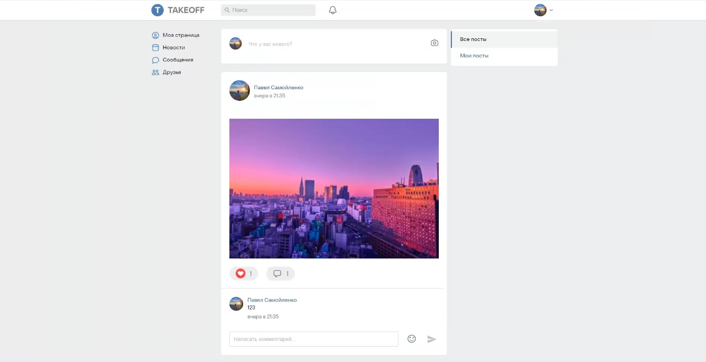

# Social network Takeoff

* [Available Scripts](#Available-Scripts)
* [Demo](#Demo)
* [Technical specifications](#Technical-specifications)

## Available Scripts

In the project directory, you can run:

### `npm run start`
Runs the app in the development mode.\
Open [http://localhost:3000](http://localhost:3000) to view it in the browser.

### `npm run stylelint`
Runs style linter for files .scss

### `npm run lint:fix`
Runs eslint for files .ts

## Demo

* :point_right: Here you can see [Demo](https://takeoff-client.vercel.app).

## Technical specifications
* React
* TypeScript
* Socket Io
* Redux toolkit
* Scss